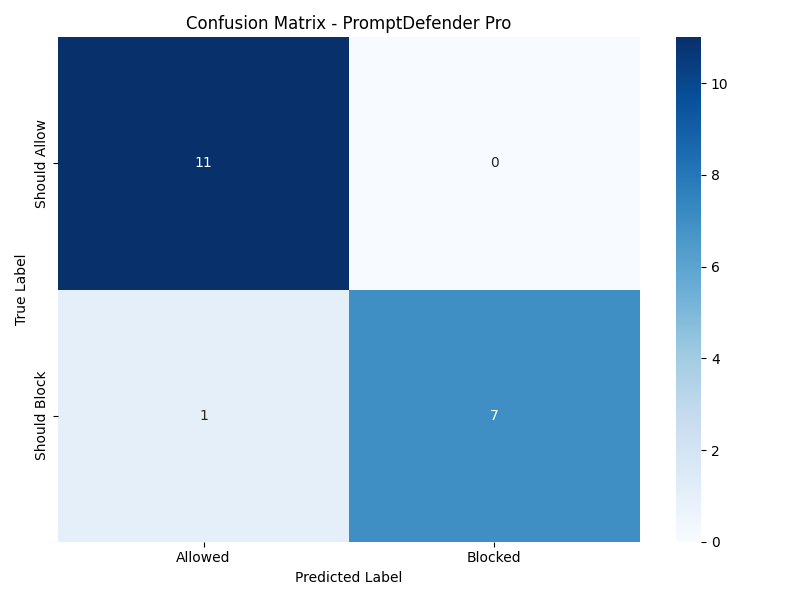
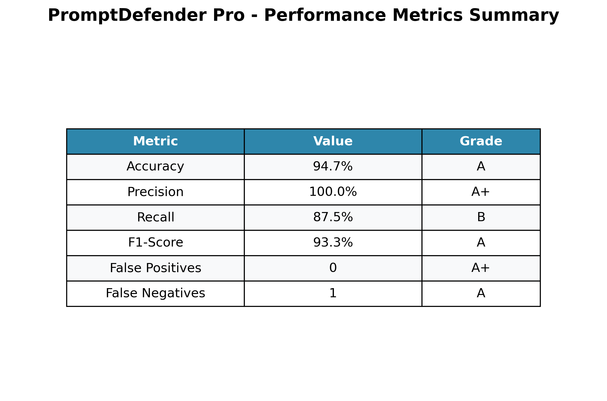
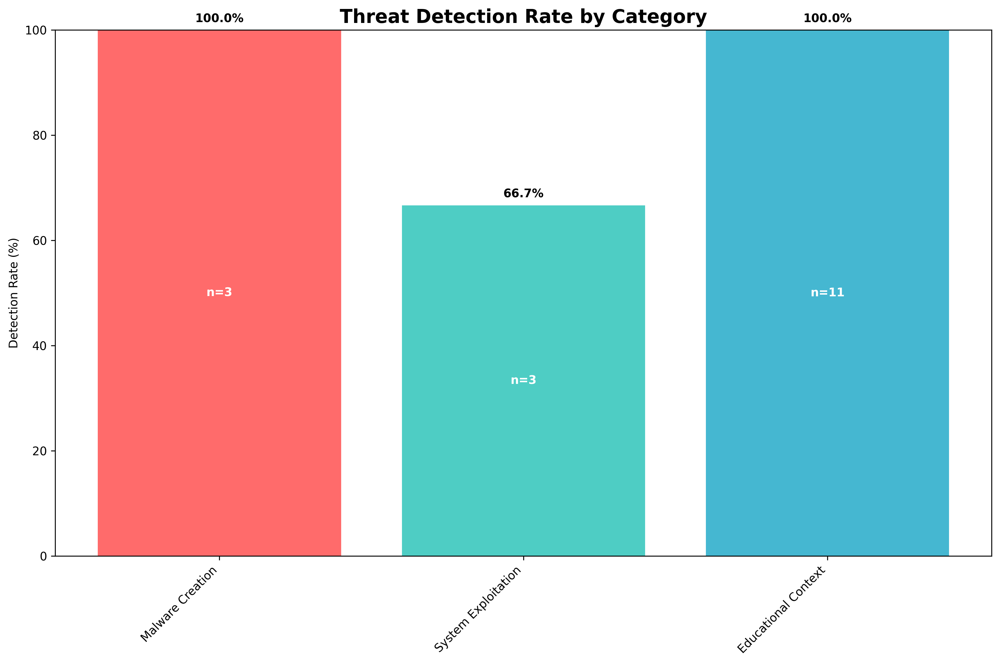

# Promptdefender
PromptDefender is a security tool that protects AI systems from prompt injection, data leaks, and misuse. It checks inputs in real time, blocks harmful prompts, and helps keep AI responses safe, reliable, and compliant.
# 🛡️ PromptDefender

PromptDefender is an AI security system that detects and blocks malicious prompts such as hacking, malware creation, and prompt injection, while allowing safe and educational content.

---

## 🚀 Features

- Detects malicious prompts (malware, hacking, DDoS, injections)
- Allows safe and educational cybersecurity prompts
- Hybrid detection:
  - Rule-based filtering
  - Keyword scoring
  - Machine Learning (DistilBERT)
- Real-time prompt analysis
- Detailed logging and confidence scores
- High accuracy with near-zero false positives

---

## 📊 Performance Highlights

- **Accuracy:** 94.7%
- **Precision:** 100%
- **Recall:** 87.5%
- **F1-Score:** 93.3%
- **False Positives:** 0
- **False Negatives:** 1

---

## 📈 Evaluation Results

### Confusion Matrix

### Performance Summary

### Threat Detection Rates

---

## 🧠 Detection Categories

- Malware Creation
- System Exploitation
- Injection Attacks
- Unauthorized Access
- Botnets
- Educational & Ethical Security
- Defensive Cybersecurity

---

## 🗂️ Project Structure
PromptDefender/
│── app.py # Flask application
│── inference.py # ML inference logic
│── train_model.py # Model training
│── ml_model_final.pkl # Trained ML model
│── requirements.txt # Dependencies
│── templates/ # HTML files
│── static/ # CSS, images
│── results/ # Evaluation results
│── enhanced_results/ # Improved model outputs
│── logs/ # Security logs
│── dataset.csv # Training data
│── test_dataset.json # Test cases
